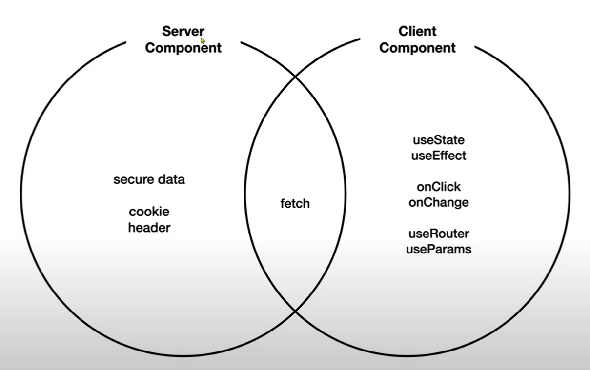
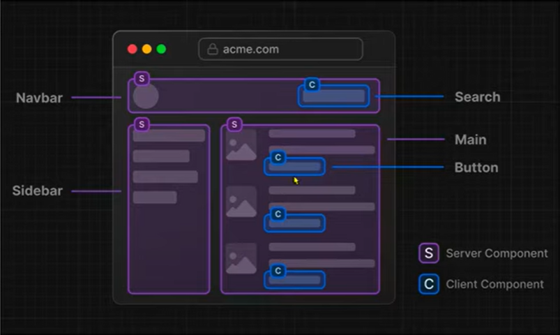

next.js에는 Server Component와 Client Component로 구분됨(react거 가져온거임)

Next.js는 특별한 조치를 하지 않으면 ServerComponent로 인식함



사용자와 상호작용하는 저 버튼만 새로운 컴포넌트로 만들어서 ClientComponent로 만드는게 유리하다

ServerComponent 단순히 보여주는 것
ClientComponent 사용자와 상호작용

## 클라이언트 컴포넌트에서 데이터 가져오기

클라이언트 컴포넌트에서 데이터를 가져오려면 React Hooks를 사용할 수 있다. 대표적으로 useState와 useEffect 훅을 활용하여 상태를 관리하고, 컴포넌트가 마운트되었을 때 데이터를 가져오는 로직을 작성할 수 있다.

```js
import { useState, useEffect } from "react";

// 클라이언트 컴포넌트에서 데이터 가져오기
const [topics, setTopics] = useState([]);
useEffect(() => {
  fetch("http://localhost:9999/topics")
    .then((result) => result.json())
    .then((data) => {
      setTopics(data);
    });
}, []);
```

위 코드에서는 useState를 사용하여 topics라는 상태와 setTopics라는 상태를 변경하는 함수를 선언한다. 그리고 useEffect 훅을 사용하여 컴포넌트가 마운트되었을 때 한 번만 실행되는 함수를 작성한다. 이 함수 내에서는 fetch API를 사용하여 데이터를 요청하고, 해당 데이터를 setTopics 함수를 통해 상태로 업데이트한다.

## 서버 컴포넌트에서 데이터 가져오기

서버 컴포넌트에서는 클라이언트와 달리 fetch API를 직접 사용하여 데이터를 가져올 수 있다. 이를 통해 서버 사이드에서 필요한 데이터를 미리 가져와서 렌더링할 수 있다.

```js
const resp = await fetch("http://localhost:9999/topics");
const topics = await resp.json();
```

위 코드에서는 fetch API를 사용하여 "http://localhost:9999/topics" 엔드포인트로 GET 요청을 보낸다. 그리고 이에 대한 응답을 await 키워드를 사용하여 기다린 후, JSON 형태로 파싱한다. 이렇게 얻은 데이터를 topics 변수에 저장한다.
